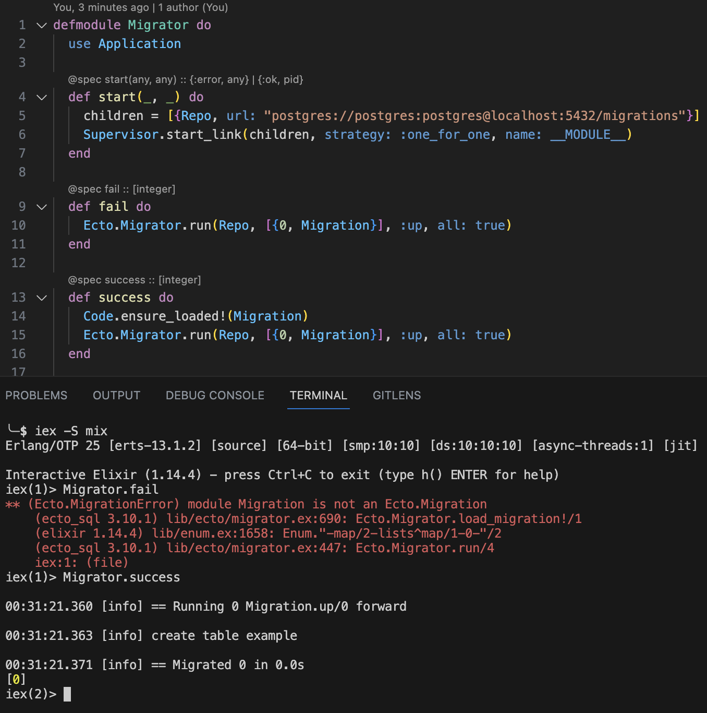

# Migrator

Example repository showing weird behaviour with Ecto.Migrator.

## Steps to reproduce
* `docker compose up -d`
* `iex -S mix`
* `Migrator.fail` => fails with `** (Ecto.MigrationError) module Migration is not an Ecto.Migration`
* `Migrator.success` => succeds after `Code.ensure_loaded?(Migration)`
